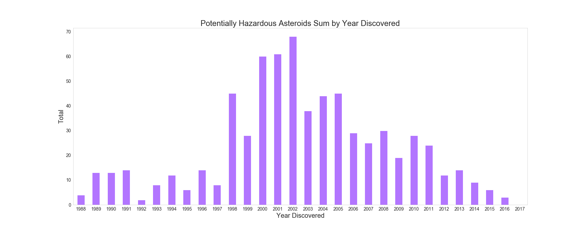

# Asteroid Classification

## Problem Statement
Considering the possibility of an asteroid colliding into Earth, what characteristics make an asteroid hazardous? Specifically, what are an asteroid's orbital characteristics and physical characteristics and which ones have a greater influence on whether or not an asteroid is hazardous?

---
## Background

Historically, stray asteroids and asteroid fragments have collided with Earth, "playing a major role in altering the geological history of the planet and in the evolution of life on Earth." [(NASA)](https://solarsystem.nasa.gov/asteroids-comets-and-meteors/asteroids/in-depth/#many_shapes_and_sizes_otp) For this reason, scientists "continuously monitor Earth-crossing asteroids, whose paths intersect Earth's orbit, and near-Earth asteroids that approach Earth's orbital distance to within about 45 million kilometers (28 million miles) and may pose an impact danger. Radar is a valuable tool in detecting and monitoring potential impact hazards. By reflecting transmitted signals off objects, images and other information can be derived from the echoes. Scientists can learn a great deal about an asteroid's orbit, rotation, size, shape, and metal concentration." [(NASA)](https://solarsystem.nasa.gov/asteroids-comets-and-meteors/asteroids/in-depth/#many_shapes_and_sizes_otp)

**Near-Earth Objects (NEOs)**  
"Near-Earth Objects (NEOs) are comets and asteroids that have been nudged by the gravitational attraction of nearby planets into orbits that allow them to enter the Earth’s neighborhood. Composed mostly of water ice with embedded dust particles, comets originally formed in the cold outer planetary system while most of the rocky asteroids formed in the warmer inner solar system between the orbits of Mars and Jupiter. The scientific interest in comets and asteroids is due largely to their status as the relatively unchanged remnant debris from the solar system formation process some 4.6 billion years ago." [[source]](https://cneos.jpl.nasa.gov/about/basics.html)

**(Near-Earth Asteroids (NEAs)**  
"The vast majority of NEOs are asteroids, referred to as Near-Earth Asteroids (NEAs). NEAs are divided into groups (Atira, Aten, Apollo and Amor) according to their perihelion distance (q), aphelion distance (Q) and their semi-major axes (a)." [source]

**Potentially Hazardous Asteroids (PHAs)**  
"Potentially Hazardous Asteroids (PHAs) are currently defined based on parameters that measure the asteroid's potential to make threatening close approaches to the Earth. Specifically, all asteroids with an Earth Minimum Orbit Intersection Distance (MOID) of 0.05 au or less and an absolute magnitude (H) of 22.0 or less are considered PHAs."
Historically, stray asteroids and asteroid fragments have collided with Earth, "playing a major role in altering the geological history of the planet and in the evolution of life on Earth." (NASA) For this reason, scientists "continuously monitor Earth-crossing asteroids, whose paths intersect Earth's orbit, and near-Earth asteroids that approach Earth's orbital distance to within about 45 million kilometers (28 million miles) and may pose an impact danger. Radar is a valuable tool in detecting and monitoring potential impact hazards. By reflecting transmitted signals off objects, images and other information can be derived from the echoes. Scientists can learn a great deal about an asteroid's orbit, rotation, size, shape, and metal concentration." (NASA)

---
## Data
Using the [JPL Small-Body Database Search Engine](https://ssd.jpl.nasa.gov/sbdb_query.cgi#x) I was able to generate a custom table of orbital and physical parameters for asteroids. I specified search constraints like object type/group, orbit class, and object characteristics as well as output fields like orbital parameters.

**Note:** All distance units are in astronomical units unless noted otherwise.

#### Data Dictionary

Name | Description | Data Type  
-----|-------------|----------
`neo                        `  | Near-Earth Objects (NEOs) are comets and asteroids that have been nudged by the gravitational attraction of nearby planets into orbits that allow them to enter the Earth’s neighborhood.    |`         int64` |
`hazardous                  `  |  Potentially Hazardous Asteroids (PHAs) are currently defined based on parameters that measure the asteroid's potential to make threatening close approaches to the Earth. Specifically, all asteroids with an Earth Minimum Orbit Intersection Distance (MOID) of 0.05 au or less and an absolute magnitude (H) of 22.0 or less are considered PHAs.  |`         int64` |
`eccentricity_(e)           `  |  Eccentricity e is the ratio of half the distance between the foci c to the semi-major axis `a: e=c/a`. For example, an orbit with e=0 is circular, e=1 is parabolic, and e between 0 and 1 is elliptic.   |`       float64` |
`semi_major_axis_(a)        `  |   One half of the major axis of the elliptical orbit; also the mean distance from the Sun.  |`       float64` |
`perihelion_dist_(q)        `  |  An orbit’s closest point to the Sun.   |`       float64` |
`inclination_(i)            `  |   The angle between the vectors normal to the body's orbit plane and the specified reference plane. Typical reference planes are the [ecliptic](https://ssd.jpl.nasa.gov/?glossary&term=ecliptic) plane and the equatorial plane (referred to a specific epoch). |`       float64` |
`perihelion_arg_(w)         `  |     |`       float64` |
`abs_magnitude_(H)          `  |  An asteroid’s absolute magnitude is the visual magnitude an observer would record if the asteroid were placed 1 Astronomical Unit ([au](https://ssd.jpl.nasa.gov/?glossary&term=au)) away, and 1 au from the Sun and at a zero phase angle.   |`       float64` |
`mean_anomaly               `  |  The product of an orbiting body's mean motion and time past [perihelion passage](https://ssd.jpl.nasa.gov/?glossary&term=tp). |`       float64` |
`aphelion_dist_(Q)          `  |  An orbit’s farthest point to the Sun.   |`       float64` |
`mean_motion_(n)            `  |   The angular speed required for a body to make one orbit around an ideal ellipse with a specific semi-major axis. It is equal to 2 times pi (π) divided by the orbital period.  |`       float64` |
`min_orbit_intersection_dist`  |   A measure used to assess potential close approaches and collision risks between astronomical objects, in this case, Earth and an asteroid.  |`       float64` |
`t_jupiter                  `  |  A dynamical quantity that is approximately conserved during an encounter between a planet and an interplanetary body   |`       float64` |
`asc_node_long_(deg)        `  |  The angle between the reference X-direction (typically the vernal equinox) and the point at which the body passes up (north) through the reference plane. This angle is often denoted as capital omega (Ω).   |`       float64` |
`orbital_per_(y)            `  |  The time required for an object to make a complete revolution along its orbit. For example, the orbital period for a typical main-belt asteroid is about 4 years.   |`       float64` |
`first_obs                  `  |  Asteroid discovery date.   |`datetime64[ns]` |
`last_obs                   `  |  Date last observed  |`datetime64[ns]` |
`class_APO                  `  |  Earth-crossing NEAs with semi-major axes larger than Earth's (named after asteroid 1862 Apollo).   |`         uint8` |
`class_ATE                  `  |  Earth-crossing NEAs with semi-major axes smaller than Earth's (named after asteroid 2062 Aten).   |`         uint8` |
`class_IEO                  `  |  NEAs whose orbits are contained entirely with the orbit of the Earth (named after asteroid 163693 Atira).   |`         uint8` |
`stand_grav_param           `  |  The product of the gravitational constant G and the mass M of the body   |`       float64` |
`rel_velocity_Q             `  |  Instantaneous velocity with respect to the aphelion position.   |`       float64` |
`rel_velocity_q             `  |   Instantaneous velocity with respect to the perihelion position.  |`       float64` |

**Data Dictionary Sources**  
[NASA Center for Near Earth Object Glossary](https://cneos.jpl.nasa.gov/glossary/h.html)  
[NASA Solar System Dynamics Glossary](https://ssd.jpl.nasa.gov/?glossary&term=H)
[Tisserand Parameter](http://www2.ess.ucla.edu/~jewitt/tisserand.html)

---
## EDA

**Drop Missing Values**  
The `name` and `full_name` columns are neither quantitative nor qualitative features for the model so I'm deciding to drop them. The column `producer` tells who first observed the asteroid, and although it is important, it will not be necessary for the model. The column `equinox` contains the same value for every observation so it is also not relevant to the model. When it comes to `diameter` and `albedo`, more than 60% of the observations are missing therefore, I am dropping the columns altogether. Lastly, I will drop the `orbital_per_(d)` because there is a column containing the same information in years: `orbital_per_(y)`.

I analyzed datatypes and converting inaccurate ones or 'dummifying' categorical ones. There are two date columns that appear as objects so I am converting those to pandas datetime types. `Neo` is also listed as an object type so I will assign 1 to observations that are NEO's and 1 to those that are not NEO's. NEO's (Near Earth Objects), in terms of orbital elements, are asteroids with perihelion distance less than 1.3 au [[source]](https://cneos.jpl.nasa.gov/about/neo_groups.html). The target label: `hazardous` is also listed as an object type, so I am assigning a 1 to non-hazardous asteroids and a 1 to potentially hazardous asteroids.

**Categorical Features**  
The asteroid orbital classes in the data are IEO (Atiras), ATE (Aten), AMO (Amor), and APO (Apollo). All four orbital classes contain hazardous and non-hazardous asteroid observations. IEOs are NEAs "whose orbits are contained entirely with the orbit of the Earth (named after asteroid 163693 Atira)." IEO is the class with the least observations for both hazardous and non-hazardous asteroids. ATEs are "Earth-crossing NEAs with semi-major axes smaller than Earth's (named after asteroid 2062 Aten)." AMOs are "Earth-approaching NEAs with orbits exterior to Earth's but interior to Mars' (named after asteroid 1221 Amor)." APOs are "Earth-crossing NEAs with semi-major axes larger than Earth's (named after asteroid 1862 Apollo)." While the majority of the observations are from the AMO class, only 3% of those are considered hazardous asteroids.
[[Source]](https://cneos.jpl.nasa.gov/about/neo_groups.html)

**Box Plot Interpretation**  
The features with the most outliers are the jupiter tisserand parameter, mean motion, epoch, inclination, and the orbital classes. Even though it is clear there are many outliers in a vast number of features, I am deciding to keep them because I don't expect all the data to be normally distributed and am also considering the fact that many of these recordings are estimations or derived from non-direct measurements. In addition, I need all the observations I have since the dataset is small and the classes are imbalanced.

**Feature Engineering: Finding Standard Gravitational Parameter to Calculate Velocity**  

**The shape of velocity**: Although we don't know the shape of an orbit, we can find the shape traced out by the velocity vectors. As an asteroid orbits, the velocity changes and rotates tangent to the curve of the orbit (no matter what the shape of the orbit may be). Using the conservation of angular momentum and Kepler's Second Law, we can estimate the instantaneous velocity vector using the orbital period, semi-major axis, and the perihelion distance. [[source]](https://www.youtube.com/watch?time_continue=728&v=xdIjYBtnvZU&feature=emb_title)

"The Standard Gravitational Parameter μ of a celestial body is the product of the gravitational constant G and the mass M of the body." [[source]](https://en.wikipedia.org/wiki/Standard_gravitational_parameter)  

**Formula:**  

"The central body in an orbital system can be defined as the one whose mass (M) is much larger than the mass of the orbiting body (m). This approximation is standard for planets orbiting the Sun or most moons and greatly simplifies equations. Under Newton's law of universal gravitation, if the distance between the bodies is r, the force exerted on the smaller body is:"  

"This can be generalized for elliptic orbits:"  

After finding the standard gravitational constant, I can use that to finally find the velocity using the formula below.  

**Formula:**  

[[source]](https://en.wikipedia.org/wiki/Standard_gravitational_parameter)

**Potentially Hazardous Asteroids Over Time**

**How have PHA observations changed over time?**  
I created two different data frame copies that use the datetime columns as the indices. The original data frame contains a `last_obs` column that states the date each observation was last observed and a `first_obs` column that states the discovery date of each observation. `df1` uses `first_obs` as the index and `last_obs` uses `df2` as the index.  

The number of hazardous asteroids discovered over the last 30 years: The distribution start off with a lower count, probably because measuring tools were not as advanced, and increases significantly in the late 90's/early 2000's. The peak is in 2002 and lowers gradually until the latest discoveries in 2017.

---
### Modeling
I tried a KNN Model, Logistic Regression Model, Support Vector Classifier, .Bagging Classifier, and Random Forest Classifier. Random Forest received the best accuracy score of 99.7%.

**Imbalanced Classes**  

**Baseline Accuracy**  
Based on the class distribution, the baseline accuracy score is about 74%. The baselines suggests that if we randomly select an observation, then there is a 74% chance that the asteroid selected is accurately classified as not hazardous.

**Best Model vs Most Interpretable Model**:
Random Forest Classifier vs. Logistic Regression.

**Model Evaluation**

While all of the models performed very well, the baseline score was 74% to begin with because the classes were highly imbalanced. All models performed better than the baseline, but the one that performed the best is Random Forest Classifier with 99.7% accuracy. Although Logistic Regression scored a 97.6% accuracy, which is about 2% lower than the Random Forest Classifier model, I would choose Logistic Regression over RFC because of the interpretability tradeoff. When graphing the features for the RFC model, the features "min orbit intersection distance" and "absolute magnitude" carry most of the weight of the predictions and not much else can be said about the rest of the features. For LogReg, we can we how likely it for an asteroid to be hazardous given a 1 unit increase in a feature.

---
### Conclusion
Asteroids orbital features are fascinating, but it was unfortunate that the target class was highly imbalanced because it takes meaning away from the accuracy of the model. According to the best model, most influential feature is the distance from the orbit of intersection, which was obvious from the beginning. The collecting more data would be ideal, but we can't create more hazardous asteroids than are in existence – and ideally, we would want there to be none. I could do more research on other features that can be influential that were not included in this dataset and gather more data that way.

---

### Limitations & Future Steps
As I mentioned before, the challenge was the fact that the classes were so imbalanced because it devalued the model.

I would like to contribute to NASA's already existing Deflection App or try to recreate something like that on my own (for learning purposes only). The app looks at questions like:
- How much velocity change is required to make the asteroid miss the Earth?
- When could an impactor spacecraft be launched in order to intercept the asteroid
- What is the maximum size of asteroid that can be deflected with a single launch?
- In which direction will the asteroid be deflected most easily?
---

### Sources
- [Orbital Class Info](https://www.permanent.com/apollo-amor-aten-near-earth-asteroids.html)
- [NASA Database](https://ssd.jpl.nasa.gov/sbdb_query.cgi#x)
- [Orbital Speed](https://en.wikipedia.org/wiki/Orbital_speed)
- [Gravitational Parameter](https://en.wikipedia.org/wiki/Standard_gravitational_parameter)
- [Asteroid Image](https://solarsystem.nasa.gov/asteroids-comets-and-meteors/asteroids/16-psyche/in-depth/)
- [PHA Orbits](https://solarsystem.nasa.gov/resources/405/orbits-of-potentially-hazardous-asteroids-phas/?category=planets_jupiter)
- [Asteroid 2002 AJ129](https://www.nasa.gov/feature/jpl/asteroid-2002-aj129-to-fly-safely-past-earth-february-4)
- [Geometry of Elliptical Orbit](http://astrolab.phys.utk.edu/Lindsay_manual/orbit_of_mercury/lab_orbit_of_mercury_v02.pdf)

### More to Explore
- [Interactive Orbit Sketch](https://minorplanetcenter.net/db_search/show_orbit?utf8=%E2%9C%93&number=111253&designation=&name=&epoch=2020-05-31.0&peri=6.9239991&m=103.20448&node=310.1588451&incl=42.0283557&e=0.439549138&a=1.7536939&commit=Interactive+Orbit+Sketch)
- [NASA Deflection App](https://cneos.jpl.nasa.gov/nda/)
